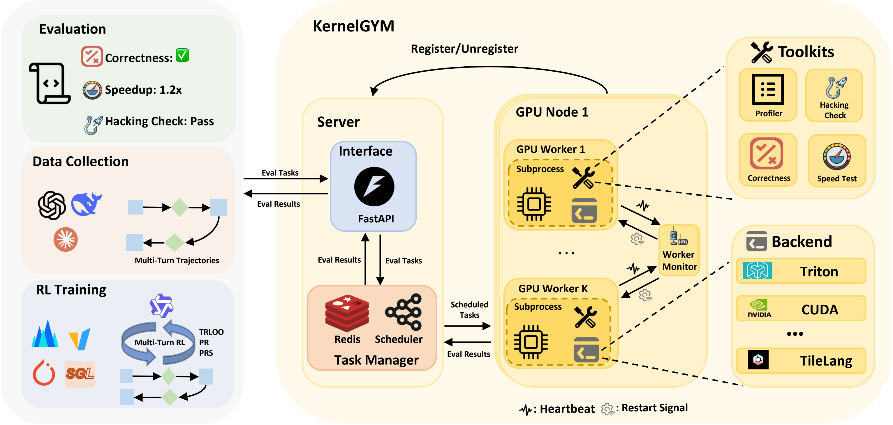

# KernelGYM: A Gym for Kernel Generations

[](https://huggingface.co/collections/hkust-nlp/drkernel)
[](https://huggingface.co/collections/hkust-nlp/drkernel)
[](https://arxiv.org/abs/2602.05885)
[](https://discord.gg/HsMvN4us)

**KernelGYM** is a GPU-distributed environment designed for evaluating and training AI models on GPU kernel generation tasks. This repository also includes our validated RL training methods from our paper:

> **Dr.Kernel: Reinforcement Learning Done Right for Triton Kernel Generations**
>
> See [drkernel/](drkernel/) for training implementation details and recipe.

### What Can You Do with KernelGYM?

- **Long-Horizon RL Training** - Train kernel generation models with multi-turn rollouts, reward hacking detection, and detailed profiling metrics
- **Agentic Trajectory Collection** - Collect high-quality training data from agent interactions with the kernel evaluation environment
- **Large-Scale Kernel Optimization** - Deploy your own agents to optimize kernel implementations across thousands of tasks in parallel
- **Parallel Kernel Evaluation** - Evaluate kernel correctness and performance across distributed GPU clusters with automatic error recovery
- **Extend to New GPU Tasks** - Build on our abstractions to support custom GPU workloads beyond kernel generation (physics simulation, rendering, etc.)

---

## Table of Contents

- [Overview](#overview)
- [Key Challenges & Highlights](#key-challenges--highlights)
- [Architecture](#architecture)
- [Installation](#installation)
- [Quick Start](#quick-start)
  - [Fastest Path (Single Node)](#fastest-path-single-node)
  - [Single-Node Deployment](#single-node-deployment)
  - [Multi-Node Distributed Deployment](#multi-node-distributed-deployment)
- [Usage Examples](#usage-examples)
  - [Example 1: Kernel Simple Task](#example-1-kernel-simple-task)
  - [Example 2: KernelBench Evaluation](#example-2-kernelbench-evaluation)
- [Supported Backends & Toolkits](#supported-backends--toolkits)
- [Extending KernelGYM](#extending-kernelgym)
  - [Adding New GPU Tasks](#adding-new-gpu-tasks)
  - [Tutorial: Kernel Simple as Extension Example](#tutorial-kernel-simple-as-extension-example)
- [Training Recipe](#training-recipe)
- [API Reference](#api-reference)

---

## Overview

Training AI models to generate optimized GPU kernels presents unique challenges that standard code generation environments cannot address. KernelGYM provides:

- **GPU-Distributed Task Scheduling**: Efficiently manage and distribute kernel evaluation tasks across multiple GPUs and nodes
- **Subprocess Isolation**: CUDA error isolation through subprocess worker pools prevents GPU crashes from affecting the main evaluation pipeline
- **Multi-Backend Support**: Evaluate kernels written in CUDA, Triton, and other frameworks
- **RL Training Integration**: Seamlessly integrate with RL training pipelines (VERL framework) for reward computation
- **Extensible Architecture**: Abstract interfaces for backends, toolkits, and workflows enable easy extension to new GPU tasks

## Key Challenges & Highlights

### Challenges in Kernel Generation Evaluation

1. **GPU Resource Management**: Unlike CPU-bound code execution, kernel evaluation requires careful GPU memory management and device isolation. A single CUDA error can crash an entire evaluation pipeline.

2. **Performance Measurement Complexity**: Accurate kernel timing requires proper warmup, multiple trials, and CUDA event synchronization - not just wall-clock timing.

3. **Correctness Verification**: Kernels must produce numerically correct results within floating-point tolerances, requiring reference implementations for comparison.

4. **Scalability**: Training requires evaluating thousands of kernel samples per batch, necessitating distributed evaluation across multiple GPUs and nodes.

### KernelGYM's Solutions

- **Subprocess Worker Pool**: Each GPU worker maintains a pool of subprocess workers. CUDA errors are isolated to subprocesses and automatically recovered, preventing cascading failures.

- **Precise Timing Infrastructure**: Built-in CUDA event-based timing with configurable warmup and trial counts ensures accurate performance measurements.

- **Flexible Correctness Checking**: Support for custom tolerance levels (rtol/atol), multiple test cases, and decoy kernel detection.

- **Horizontal Scalability**: Redis-based task queue enables seamless scaling from single-GPU to multi-node deployments.

## Architecture

<p align="center">
  
</p>

High-level architecture of KernelGYM: API server + task manager + distributed GPU workers with subprocess isolation.

```
┌─────────────────────────────────────────────────────────────────────┐
│                          KernelGYM Architecture                      │
├─────────────────────────────────────────────────────────────────────┤
│                                                                      │
│  ┌──────────────┐    ┌──────────────┐    ┌──────────────────────┐   │
│  │   Client     │───▶│  API Server  │───▶│   Task Manager       │   │
│  │  (Training)  │    │  (FastAPI)   │    │   (Redis Queue)      │   │
│  └──────────────┘    └──────────────┘    └──────────┬───────────┘   │
│                                                      │               │
│                      ┌───────────────────────────────┴───────────┐   │
│                      │              Worker Layer                  │   │
│  ┌───────────────────┼───────────────────────────────────────────┤   │
│  │                   ▼                                           │   │
│  │  ┌─────────────────────┐  ┌─────────────────────┐             │   │
│  │  │   GPU Worker 0      │  │   GPU Worker N      │             │   │
│  │  │  ┌───────────────┐  │  │  ┌───────────────┐  │             │   │
│  │  │  │ Subprocess    │  │  │  │ Subprocess    │  │    ...      │   │
│  │  │  │ Pool (CUDA    │  │  │  │ Pool (CUDA    │  │             │   │
│  │  │  │ Isolation)    │  │  │  │ Isolation)    │  │             │   │
│  │  │  └───────────────┘  │  │  └───────────────┘  │             │   │
│  │  └─────────────────────┘  └─────────────────────┘             │   │
│  │                                                               │   │
│  └───────────────────────────────────────────────────────────────┘   │
│                                                                      │
│  ┌───────────────────────────────────────────────────────────────┐   │
│  │                     Core Components                            │   │
│  │  ┌─────────────┐  ┌─────────────┐  ┌─────────────────────┐    │   │
│  │  │  Backends   │  │  Toolkits   │  │  Workflow Controllers│    │   │
│  │  │  (Compile/  │  │  (Evaluate) │  │  (Orchestrate)       │    │   │
│  │  │   Load/Run) │  │             │  │                      │    │   │
│  │  └─────────────┘  └─────────────┘  └─────────────────────┘    │   │
│  └───────────────────────────────────────────────────────────────┘   │
│                                                                      │
└─────────────────────────────────────────────────────────────────────┘
```

### Core Components

| Component | Description |
|-----------|-------------|
| **Backend** | Handles kernel compilation, loading, and execution. Abstracts different kernel frameworks (CUDA, Triton). |
| **Toolkit** | Implements evaluation logic - correctness checking, performance measurement, profiling. |
| **Workflow Controller** | Orchestrates multi-step evaluation workflows (e.g., reference timing + kernel evaluation). |
| **Task Manager** | Redis-based queue management with priority scheduling and worker assignment. |
| **GPU Worker** | Manages task execution on a specific GPU with subprocess isolation for error recovery. |

## Installation

### Prerequisites

- Python 3.10+
- CUDA 11.8+ with compatible GPU
- Redis server
- Linux (Ubuntu 20.04+ recommended)

### Setup

```bash
# Clone the repository
git clone https://github.com/hkust-nlp/KernelGYM.git
cd kernelgym

# Run the setup script
bash setup.sh
```

The setup script will:
1. Install Python dependencies from `requirements.txt`
2. Install additional packages (pydantic-settings)
3. Install system utilities (iproute2)
4. Install Redis for local deployment

### Configuration

You have two options:

1. Recommended: let KernelGYM auto-generate `.env` on first startup.
2. Manual: create `.env` yourself with explicit values.

Manual `.env` example:

```bash
# Redis Configuration
REDIS_HOST=localhost
REDIS_PORT=6379
REDIS_PASSWORD=  # Optional

# API Server Configuration
API_HOST=0.0.0.0
API_PORT=10907

# GPU Configuration
GPU_DEVICES=[0,1,2,3,4,5,6,7]  # List of GPU indices to use

# Optional: Node identification for multi-node setup
NODE_ID=node-1
```

## Quick Start

### Fastest Path (Single Node)

If your goal is to get a local KernelGYM service up quickly:

```bash
# 1) Install dependencies
bash setup.sh

# 2) Auto-configure .env (or skip; start script can do this automatically)
bash scripts/auto_configure.sh

# 3) Start API + workers
./start_all_with_monitor.sh

# 4) Verify service
curl http://localhost:10907/health
curl http://localhost:10907/workers/status
```

`scripts/auto_configure.sh` includes a practical example strategy for fast setup:
- Detect host/IP and GPU list
- Find available ports for Redis/API/Metrics from candidate port pools

Treat this as a reference implementation, not a fixed policy. If your machine or cluster has different networking constraints, edit the port-selection logic in `scripts/auto_configure.sh` (for example, custom port ranges, reserved ports, or service-specific pinning) to match your environment.

### Single-Node Deployment

For single-node deployments with all components on one machine:

```bash
# Start the API server and workers
./start_all_with_monitor.sh
```

This script starts:
- The FastAPI server on the configured port
- GPU workers for each configured device
- A monitoring process for worker health checks

Notes:
- If `.env` does not exist, `start_all_with_monitor.sh` triggers `scripts/auto_configure.sh`.
- If Redis is configured as local (`localhost`/`127.0.0.1`) and not running, the startup script launches Redis automatically.

### Multi-Node Distributed Deployment

For distributed setups across multiple machines:

**On the main node (API server + Redis):**
```bash
# Ensure Redis is accessible from worker nodes
redis-server --bind 0.0.0.0

# Start API server
python -m kernelgym.server.api.server
```

**On worker nodes:**

1. Create a `.env` file pointing to the main node:
```bash
API_HOST=<main_node_ip>
API_PORT=10907
REDIS_HOST=<main_node_ip>
REDIS_PORT=6379
NODE_ID=worker-node-1  # Unique identifier for this node
GPU_DEVICES=[0,1,2,3]  # GPUs available on this node
```

2. Start the worker:
```bash
./start_worker_multinode.sh
```

The worker will:
1. Connect to the main node's API server
2. Register itself and allocate a node ID
3. Start GPU workers that pull tasks from the shared Redis queue

### Deployment Scripts Reference

For more details on deployment configuration and options, refer to these scripts:

| Script | Description |
|--------|-------------|
| [scripts/auto_configure.sh](scripts/auto_configure.sh) | Auto-generates `.env` configuration with detected IP, available ports, and GPU devices |
| [start_all_with_monitor.sh](start_all_with_monitor.sh) | Single-node deployment: starts Redis, API server, worker monitor, and GPU workers |
| [start_worker_multinode.sh](start_worker_multinode.sh) | Multi-node worker startup: connects worker nodes to remote API/Redis server |

Useful `auto_configure.sh` options:
- `bash scripts/auto_configure.sh --force` to overwrite existing `.env`
- `bash scripts/auto_configure.sh --use-indexed-ports` to use `PORT0`, `PORT1`, ... as candidates

## Usage Examples

### Example 1: Kernel Simple Task

The `kernel_simple` workflow evaluates a standalone kernel with provided test cases:

```python
import httpx
import asyncio

async def evaluate_kernel_simple():
    async with httpx.AsyncClient() as client:
        response = await client.post(
            "http://localhost:10907/workflow/submit",
            json={
                "workflow": "kernel_simple",
                "task_id": "my-kernel-task-001",
                "payload": {
                    "task_id": "my-kernel-task-001",
                    "kernel_code": '''
import torch
import triton
import triton.language as tl

@triton.jit
def add_kernel(x_ptr, y_ptr, output_ptr, n_elements, BLOCK_SIZE: tl.constexpr):
    pid = tl.program_id(axis=0)
    block_start = pid * BLOCK_SIZE
    offsets = block_start + tl.arange(0, BLOCK_SIZE)
    mask = offsets < n_elements
    x = tl.load(x_ptr + offsets, mask=mask)
    y = tl.load(y_ptr + offsets, mask=mask)
    output = x + y
    tl.store(output_ptr + offsets, output, mask=mask)

class ModelNew(torch.nn.Module):
    def __init__(self):
        super().__init__()

    def forward(self, x, y):
        output = torch.empty_like(x)
        n_elements = x.numel()
        grid = lambda meta: (triton.cdiv(n_elements, meta['BLOCK_SIZE']),)
        add_kernel[grid](x, y, output, n_elements, BLOCK_SIZE=1024)
        return output

def get_init_inputs():
    return []

def get_inputs():
    x = torch.randn(1024, device='cuda')
    y = torch.randn(1024, device='cuda')
    return [x, y]

def get_cases():
    x = torch.randn(1024, device='cuda')
    y = torch.randn(1024, device='cuda')
    expected = x + y
    return [{"inputs": [x, y], "outputs": expected}]
''',
                    "entry_point": "ModelNew",
                    "backend": "triton",
                    "device": "npu:0",
                    "run_correctness": True,
                    "run_performance": True,
                    "num_perf_trials": 100,
                }
            }
        )
        return response.json()

result = asyncio.run(evaluate_kernel_simple())
print(f"Compiled: {result['result']['compiled']}")
print(f"Correctness: {result['result']['correctness']}")
print(f"Runtime: {result['result']['kernel_runtime']:.4f} ms")
```

### Example 2: KernelBench Evaluation

The `kernelbench` workflow compares a generated kernel against a reference implementation:

```python
import httpx
import asyncio

async def evaluate_kernelbench():
    reference_code = '''
import torch

class Model(torch.nn.Module):
    def __init__(self):
        super().__init__()

    def forward(self, x):
        return torch.softmax(x, dim=-1)

def get_init_inputs():
    return []

def get_inputs():
    return [torch.randn(32, 512, device='cuda')]
'''

    kernel_code = '''
import torch
import triton
import triton.language as tl

@triton.jit
def softmax_kernel(input_ptr, output_ptr, n_cols, BLOCK_SIZE: tl.constexpr):
    row_idx = tl.program_id(0)
    col_offsets = tl.arange(0, BLOCK_SIZE)
    mask = col_offsets < n_cols

    row_start = row_idx * n_cols
    input_ptrs = input_ptr + row_start + col_offsets

    row = tl.load(input_ptrs, mask=mask, other=-float('inf'))
    row_max = tl.max(row, axis=0)
    numerator = tl.exp(row - row_max)
    denominator = tl.sum(numerator, axis=0)
    softmax_output = numerator / denominator

    output_ptrs = output_ptr + row_start + col_offsets
    tl.store(output_ptrs, softmax_output, mask=mask)

class ModelNew(torch.nn.Module):
    def __init__(self):
        super().__init__()

    def forward(self, x):
        n_rows, n_cols = x.shape
        output = torch.empty_like(x)
        BLOCK_SIZE = triton.next_power_of_2(n_cols)
        softmax_kernel[(n_rows,)](x, output, n_cols, BLOCK_SIZE=BLOCK_SIZE)
        return output

def get_init_inputs():
    return []

def get_inputs():
    return [torch.randn(32, 512, device='cuda')]
'''

    async with httpx.AsyncClient() as client:
        response = await client.post(
            "http://localhost:10907/evaluate",
            json={
                "task_id": "softmax-kernel-001",
                "reference_code": reference_code,
                "kernel_code": kernel_code,
                "entry_point": "Model",
                "backend": "triton",
                "num_correct_trials": 5,
                "num_perf_trials": 100,
            }
        )
        return response.json()

result = asyncio.run(evaluate_kernelbench())
print(f"Compiled: {result['compiled']}")
print(f"Correctness: {result['correctness']}")
print(f"Speedup: {result['speedup']:.2f}x")
print(f"Reference Runtime: {result['reference_runtime']:.4f} ms")
print(f"Kernel Runtime: {result['kernel_runtime']:.4f} ms")
```

## Supported Backends & Toolkits

### Backends

| Backend | Description | Use Case |
|---------|-------------|----------|
| **kernelbench** | Full KernelBench evaluation backend | Reference-based kernel evaluation with CUDA/Triton support |

The KernelBench backend supports two sub-backends:
- **CUDA**: For kernels using PyTorch's CUDA extensions or inline CUDA code
- **Triton**: For kernels using OpenAI's Triton language

KernelBench evaluation also supports two execution modes:
- **Eager Mode**: Direct execution without compilation optimization (default)
- **Compile Mode**: Uses `torch.compile()` for optimized execution and fair comparison with compiled references

To select execution mode, use the `reference_backend` parameter:

```python
# Eager mode (default) - compare against eager PyTorch reference
payload = {
    "backend": "triton",
    "reference_backend": "pytorch",  # or omit for default
    # ...
}

# Compile mode - compare against torch.compile() optimized reference
payload = {
    "backend": "triton",
    "reference_backend": "compile",
    # ...
}
```

### Toolkits

| Toolkit | Description | Workflow |
|---------|-------------|----------|
| **kernelbench** | Full evaluation with reference comparison | `kernelbench` |
| **kernel_simple** | Standalone kernel evaluation with test cases | `kernel_simple` |

### Using Different Backends

```python
# For Triton kernels
payload = {
    "backend": "triton",
    # ...
}

# For CUDA kernels
payload = {
    "backend": "cuda",
    # ...
}
```

## Extending KernelGYM

KernelGYM is designed to be extensible. You can add new GPU tasks by implementing the core abstractions.

### Adding New GPU Tasks

To add support for a new type of GPU task, implement these components:

#### 1. Define a Backend (if needed)

```python
# backend/my_backend.py
from kernelgym.backend.base import Backend

class MyBackend(Backend):
    name = "my_backend"

    def compile(self, code: str, **kwargs):
        """Compile kernel code and return build metadata."""
        # Implementation
        return {"compiled": True, "artifact": compiled_module}

    def load(self, artifact, **kwargs):
        """Load compiled artifact for execution."""
        # Implementation
        return handle

    def run(self, handle, inputs, **kwargs):
        """Execute and return runtime metrics."""
        # Implementation
        return {"output": result, "runtime": elapsed_ms}
```

Register your backend:
```python
from kernelgym.backend import register_backend
register_backend("my_backend", MyBackend)
```

#### 2. Define a Toolkit

```python
# toolkit/my_toolkit.py
from kernelgym.toolkit.base import Toolkit

class MyToolkit(Toolkit):
    name = "my_toolkit"

    def evaluate(self, task, backend, **kwargs):
        """Run evaluation logic against a backend."""
        # Compile
        artifact = backend.compile(task["code"])
        if not artifact["compiled"]:
            return {"status": "failed", "error": "compilation failed"}

        # Load and run
        handle = backend.load(artifact)
        result = backend.run(handle, task["inputs"])

        # Cleanup
        backend.cleanup(handle)

        return {
            "status": "completed",
            "output": result["output"],
            "runtime": result["runtime"],
        }
```

Register your toolkit:
```python
from kernelgym.toolkit import register_toolkit
register_toolkit("my_toolkit", MyToolkit)
```

#### 3. Define a Workflow Controller (optional)

```python
# workflow/my_workflow.py
from kernelgym.core.workflow import WorkflowController

class MyWorkflowController(WorkflowController):
    async def handle_request(self, input_data, scheduler):
        # Create task spec
        task_spec = TaskSpec(
            kind="my_task",
            payload={
                **input_data,
                "toolkit": "my_toolkit",
                "backend_adapter": "my_backend",
            }
        )

        # Submit and wait
        task_id = await scheduler.submit(task_spec)
        result = await scheduler.wait(task_id)

        return result
```

### Tutorial: Kernel Simple as Extension Example

The `kernel_simple` module demonstrates how to extend KernelGYM for custom evaluation logic. Here's how it's structured:

**1. Schema Definition** ([kernelgym/schema/simple_task.py](kernelgym/schema/simple_task.py)):
```python
@dataclass
class KernelSimpleTask:
    task_id: str
    kernel_code: str
    entry_point: str = "ModelNew"
    device: str = "npu:0"
    backend: str = "triton"
    cases: Optional[List[Dict]] = None  # Test cases
    run_correctness: Optional[bool] = None
    run_performance: Optional[bool] = None
    # ...
```

**2. Toolkit Implementation** ([kernelgym/toolkit/kernel_simple/toolkit.py](kernelgym/toolkit/kernel_simple/toolkit.py)):
- Loads test cases from code or explicit definition
- Compiles and loads the kernel via backend
- Runs correctness checks against expected outputs
- Measures performance using CUDA events

**3. Workflow Controller** ([kernelgym/workflow/kernel_simple.py](kernelgym/workflow/kernel_simple.py)):
- Validates the request
- Submits task to scheduler
- Returns aggregated results

This pattern can be replicated for any GPU task type (image processing, physics simulation, etc.).

## Training Recipe

For RL training using KernelGYM, see the [drkernel/](drkernel/) directory which contains:

- **VERL Integration**: Full integration with the VERL framework for distributed RL training
- **Reward Functions**: Multi-dimensional rewards based on compilation, correctness, and performance
- **Training Scripts**: Ready-to-use training configurations and scripts

See [drkernel/README.md](drkernel/README.md) for detailed training documentation.

## API Reference

### Core Endpoints

| Endpoint | Method | Description |
|----------|--------|-------------|
| `/evaluate` | POST | Submit a KernelBench evaluation task |
| `/evaluate/batch` | POST | Submit multiple evaluation tasks |
| `/workflow/submit` | POST | Submit a workflow task (kernel_simple, etc.) |
| `/status/{task_id}` | GET | Get task status |
| `/results/{task_id}` | GET | Get task results |
| `/health` | GET | System health check |
| `/workers/status` | GET | Get worker status |

### Worker Management

| Endpoint | Method | Description |
|----------|--------|-------------|
| `/worker/register` | POST | Register a worker |
| `/worker/heartbeat` | POST | Update worker heartbeat |
| `/node/allocate` | POST | Allocate a node ID |

### Example API Call

```bash
curl -X POST "http://localhost:10907/evaluate" \
  -H "Content-Type: application/json" \
  -d '{
    "task_id": "test-001",
    "reference_code": "...",
    "kernel_code": "...",
    "entry_point": "Model",
    "backend": "triton"
  }'
```

---

## Citation

If you use our resources in your research, please cite our paper:

```bibtex
@article{liuetal2026,
  title={Dr.Kernel: Reinforcement Learning Done Right for Triton Kernel Generations},
  author={Wei Liu, Jiawei Xu, Yingru Li, Longtao Zheng, Tianjian Li, Qian Liu, Junxian He},
  journal={arXiv:2602.05885},
  year={2026}
}
```

## License

This project is licensed under the Apache License 2.0 - see the LICENSE file for details.

## Acknowledgement
This repo is based on [VERL](https://github.com/verl-project/verl) and [KernelBench](https://github.com/ScalingIntelligence/KernelBench).
